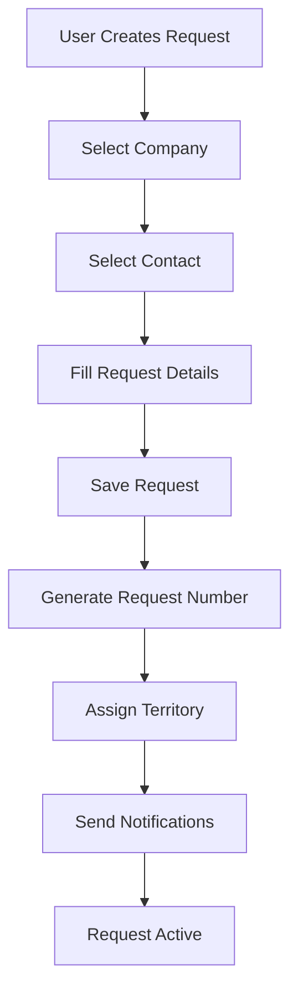
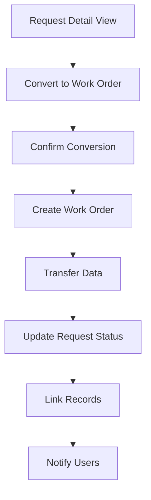

# Integration Guide - Requests Module

## Overview
The Requests module integrates seamlessly with other FSM platform modules to provide a comprehensive service management experience. This guide covers integration points and how requests flow through the system.

## Module Integration Points

### 1. Customer Management Integration

#### Companies (Clients) Integration
- **Purpose**: Associate requests with specific customer companies
- **Relationship**: `requests.company_id` → `clients.id`
- **Features**:
  - Company selection dropdown in request forms
  - Company filtering in request listings
  - Company information display in request details

#### Contacts Integration
- **Purpose**: Link requests to specific contact persons
- **Relationship**: `requests.contact_id` → `contacts.id`
- **Features**:
  - Contact selection (filtered by company)
  - Primary contact display in request details
  - Contact communication history

### 2. Work Order Management Integration

#### Request to Work Order Conversion
- **Trigger**: "Convert to Work Order" button in request detail view
- **Process**:
  1. User clicks conversion button
  2. Confirmation dialog displayed
  3. Redirect to work order creation form
  4. Request data pre-fills work order fields
  5. Request status updates to "Converted"

**Pre-filled Fields**:
- Customer information (company/contact)
- Request description
- Priority level
- Territory assignment

#### Estimates Integration
- **Trigger**: "Convert to Estimate" option in actions dropdown
- **Process**: Similar to work order conversion
- **Pre-filled Fields**: Request details, customer info, description

### 3. User Management Integration

#### User Authentication
- **Session Management**: Uses `UserSessionModel` for authentication
- **User Tracking**: Records who created and modified requests
- **Permissions**: Role-based access to request functions

#### Activity Tracking
- **Created By**: Tracks request creator
- **Last Modified By**: Tracks who made changes
- **Audit Trail**: Maintains history of request modifications

### 4. Territory Management Integration

#### Territory Assignment
- **Purpose**: Associate requests with service territories
- **Relationship**: `requests.territory_id` → `territories.id`
- **Features**:
  - Automatic territory assignment based on customer location
  - Territory-based request filtering
  - Technician dispatch by territory

## Data Flow

### Request Creation Workflow



### Request to Work Order Conversion



## API Integration

### External System Integration

#### Webhook Support
- **Request Created**: Triggered when new request is created
- **Status Changed**: Triggered when request status updates
- **Request Converted**: Triggered when converted to work order/estimate

#### RESTful API Endpoints
```
GET    /api/requests                # List requests
POST   /api/requests                # Create request
GET    /api/requests/{id}           # Get request details
PUT    /api/requests/{id}           # Update request
DELETE /api/requests/{id}           # Delete request
POST   /api/requests/{id}/convert   # Convert to work order
```

### Integration Authentication
- **API Keys**: For external system access
- **OAuth 2.0**: For third-party integrations
- **Session Tokens**: For web application access

## Notification Integration

### Email Notifications
- **Request Created**: Notify assigned personnel
- **Status Updates**: Notify stakeholders of status changes
- **Conversion Completed**: Notify when converted to work order

### In-App Notifications
- **Dashboard Updates**: Real-time request count updates
- **Activity Feed**: Recent request activities
- **Alert System**: High-priority request notifications

## Reporting Integration

### Dashboard Metrics
- **Request Counts**: Total, pending, in progress, completed
- **Priority Distribution**: High, medium, low priority counts
- **Conversion Rates**: Requests converted to work orders/estimates
- **Response Times**: Average time to first response

### Report Generation
- **Request Summary Reports**: Filterable by date, status, priority
- **Conversion Analytics**: Track conversion rates and success metrics
- **Customer Reports**: Request history by customer/company
- **Technician Reports**: Requests by assigned territory/technician

## Configuration Integration

### System Settings
- **Default Priority**: System-wide default priority for new requests
- **Auto-Assignment Rules**: Automatic territory assignment based on location
- **Status Workflow**: Customizable status progression rules
- **Notification Settings**: Configure who receives what notifications

### User Preferences
- **Default Views**: User-specific default filters and sorting
- **Notification Preferences**: Individual notification settings
- **Dashboard Layout**: Customizable request widgets

## Security Integration

### Access Control
- **Role-Based Permissions**: Control who can view/edit/delete requests
- **Territory Restrictions**: Limit access to requests by territory
- **Company Filtering**: Restrict access to specific customer requests

### Audit Trail
- **Change Tracking**: Log all request modifications
- **User Actions**: Track who performed what actions when
- **Data Retention**: Configurable audit log retention periods

## Mobile Integration

### Mobile App Support
- **API Compatibility**: Full API support for mobile applications
- **Offline Capability**: Cache requests for offline viewing
- **Push Notifications**: Mobile push notifications for request updates

### Responsive Web Access
- **Mobile-Optimized UI**: Fully responsive request interface
- **Touch-Friendly Controls**: Mobile-optimized buttons and forms
- **Performance Optimization**: Fast loading on mobile networks

## Integration Best Practices

### Data Consistency
- **Transaction Management**: Use database transactions for multi-table operations
- **Referential Integrity**: Maintain proper foreign key relationships
- **Data Validation**: Consistent validation across all integration points

### Performance Considerations
- **Lazy Loading**: Load related data only when needed
- **Caching Strategy**: Cache frequently accessed integration data
- **Background Processing**: Handle heavy integrations asynchronously

### Error Handling
- **Graceful Degradation**: Continue operating when integrations fail
- **Retry Mechanisms**: Automatic retry for failed integration attempts
- **Logging**: Comprehensive logging of integration activities and errors

---

*Last Updated*: January 2025  
*Version*: 1.0  
*Module*: Requests - Integration Guide Documentation